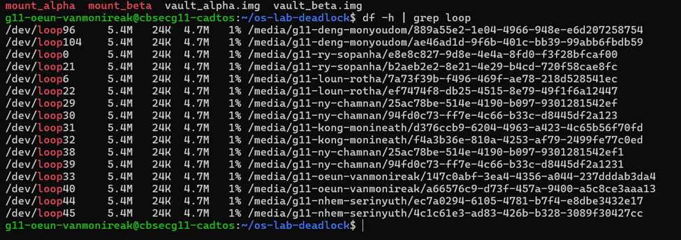
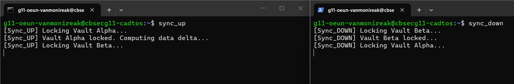
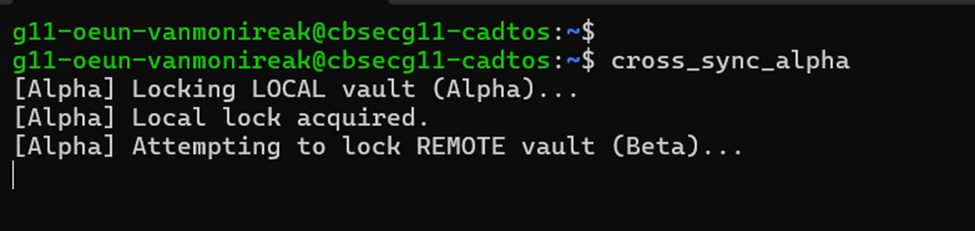
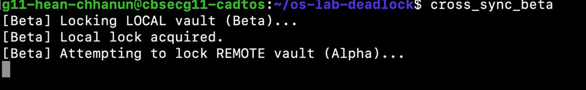
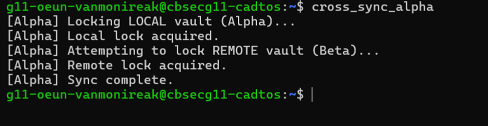
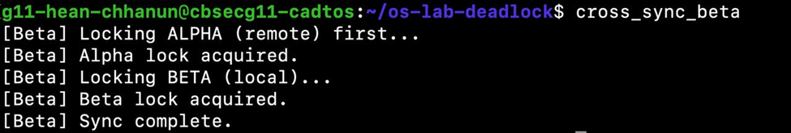
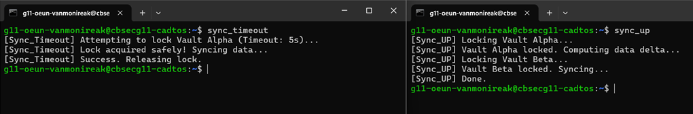
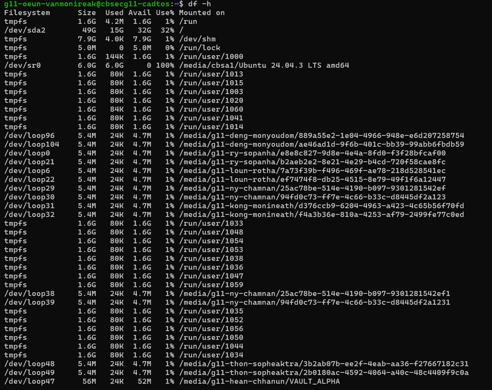

# OS Lab: The Quantum Vault Deadlock

## Student Info
- Name: Oeun Vanmonireak
- Student ID: IDTB110144

---

## Level 1: Virtual Vault Provisioning

### Screenshot

### Explanation
This output shows that the virtual disk image files are successfully attached as loop devices and mounted into the file system.

---

## Level 2 & 3: Local Deadlock

### Screenshot

### Explanation
The deadlock occurs because sync_up locks Vault Alpha first and waits for Vault Beta, while sync_down locks Vault Beta first and waits for Vault Alpha. This creates a circular wait condition, causing both processes to freeze.

---

## Level 4: Distributed Deadlock

### Screenshot
Player A 

Player B

### Explanation
Each user locks their own vault first and then attempts to lock the partner’s vault. This creates a distributed circular wait, resulting in a deadlock across users.

---

## Level 5: Deadlock Prevention (Resource Ordering)

### Screenshot
Player A

Player B

### Explanation
Deadlock is prevented by enforcing a global resource order where all processes must lock Alpha before Beta. This removes the circular wait condition.

---

## Level 6: Deadlock Recovery (Timeout)

### Screenshot

### Explanation
The timeout mechanism using `flock -w 5` prevents infinite waiting. If a lock cannot be acquired within 5 seconds, the process aborts, improving system reliability.

---

## Level 7: Teardown

### Screenshot

### Explanation
Proper unmounting and loop device removal ensures no resource leaks and prevents file system corruption.

---